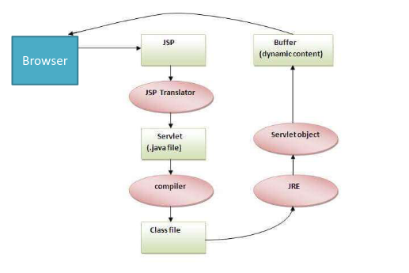

- # Database java UNIT3
	- ## Database Connect
	  collapsed:: true
		- ```
		  import java.sql.*;
		  
		  public class Connections{
		  	static String url = "jdbc:mysql://localhost:3306/dbname";
		  	static String driver = "com.mysql.jdbc.Driver";
		  	static String user = "root";
		  	static String pass = "test";
		  
		  	public static void main(String[] args){
		      	Connection conn = null;
		          try{
		          	Class.forName(driver);
		              conn = DriverManager.getConnection(url,user,pass);
		              ...
		          }catch(ClassNotFoundException e){
		          }catch(SqlException e){
		          }finally{
		          try{
		          	conn.close();
		          }
		          }
		      }
		  
		  
		  }
		  ```
	- ## Statement Execution
	  collapsed:: true
		- ## Prepared Statement
			- ```
			  
			  
			  //Prepared Statement
			  String Query = "insert into Movies values(?,?,?,?,?)";
			  PreparedStatement ps = conn.prepareStatement(Query);
			  ps.setInt(1,5);
			  ps.setString(2,"Avatar");
			  ps.setString(3,"Nicholas Cage");
			  ps.setString(4,"Movie monger");
			  ps.setString(5,"James Cameron")
			  
			  ps.executeUpdate();
			  
			  
			  
			  ```
		- ## Statement
			- ```
			  Statement st = conn.createStatement();
			  
			  st.executeUpdate("Insert Into Student (name,phone,email) values('"+name+"','"+phone+"','"+email+"')" ");
			  st.executeQuery("Select * from Students");
			  
			  
			  ```
	- ## DRIVER TYPES
	  collapsed:: true
		- Type 1: Java JDBC-ODBC driver
			- Advantage
				- easy to use
				- can be easily connected to any database
			- Disadvantage
				- degraded performance because JDBC call is converted to ODBC function call
				- the ODBC driver has to be installed on the client machine
				- Platform dependent
		- Type 2: Native API / Partly Driver / Native Driver
			- Advantage
				- Better performance compared to JDBC-ODBC
			- Disadvantage
				- need to install Native Driver on client machine
				- vendor library needs to be installed
				- platform and vendor dependent
		- Type 3: Java Net Protocol / Network Protocol Driver
			- Client side library is not required
			-
		- Type 4:  Pure Java / Thin Driver
		-
- # JSP UNIT 5
	- ## Advantages of JSP
		- for JSP Page, WEB.xml file need not be configured
		- presenting the data is very fast
		- modifications in jsp are directly reflected
		- allows html, text and java code
	- ## JSP Life Cycle
		- 
	- ## Page Interface
		- #TODO
	- ## JSP scripting elements
		- ### JSP declaration Tag
			- used to declare fields and methods.
			- code written inside the jsp declaration tag is placed outside the service() method of the auto generated servlet.
			- ```
			  //EXAMPLE variable
			  
			  <html>
			  <body>
			  <%! int data=50; %>
			  </body>
			  </html>
			  
			  //Example Method
			  
			  <html>
			  <body>
			  <%!
			  int cube(int n){
			  return n*n*n*;
			  }
			  %>
			  <%= "Cube of 3 is:"+cube(3) %>
			  </body>
			  </html>
			  ```
		- ### JSP Scriptlet Tag
			- is used to execute java source code in jsp
			- ```
			  //Example
			  
			  <html>
			  <body>
			  <% out.print("welcome to jsp"); %>
			  </body>
			  </html>
			  ```
			- ```
			  //Example to print user-name
			  
			  //Home.html
			  
			  <html>
			  <body>
			  <form action="welcome.jsp">
			  <input type="text" name="uname">
			  <input type="submit" value="go"><br/>
			  </form>
			  </body>
			  </html>
			  
			  //Welcome.jsp
			  
			  <html>
			  <body>
			  <%
			  String name=request.getParameter("uname");
			  out.print("welcome "+name);
			  %>
			  </form>
			  </body>
			  </html>
			  ```
		- ### JSP Expression Tag
			- expression Tag is written to the output stream of the response.
			- used to print the values of variable method
			- ```
			  Example to print user-name:
			  Welcome.jsp
			  
			  <html>
			  <body>
			  <%= "Welcome "+request.getParameter("uname") %>
			  </body>
			  </html>
			  ```
		- ### SCRIPTLET VS DECLARATION Tag
			- @@html: <table><thead><tr><th>JSP Scriptlet Tag</th><th>JSP Declaration Tag</th></tr></thead>
			  <tbody>
			    <tr>
			      <td>The JSP scriptlet tag can only declare variables not methods</td>
			      <td>JSP declaration tag can declare variables as well as methods</td>
			    </tr>
			    <tr>
			      <td>declaration of scriptlet tag is placed inside the _jspService() Method</td>
			      <td>declaration of jsp declaration tag is placed outside the _jspService() method.<br></td>
			    </tr>
			  </tbody>
			  </table>@@
			-