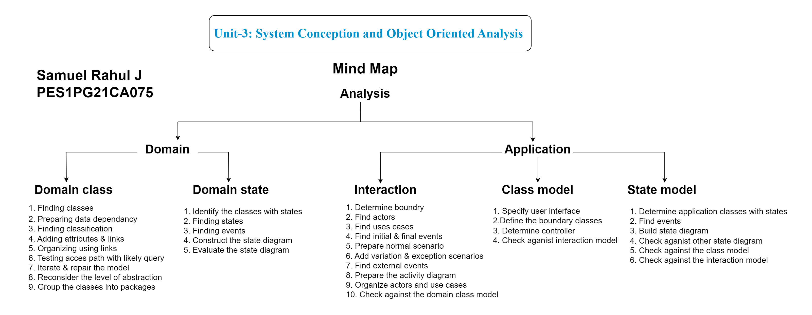

- # UNIT 3
	- ## SYSTEM CONCEPTION
	  collapsed:: true
		-
		-
		- deals with genesis of application
		- purpose is to  <ins>defer details </ins> and <ins>understand the big picture</ins>
		- ### Steps for system conception
			- ##### 1: Devising a System Concept
				- Some ways of devising new System Concepts
					- <ins>New Functionality:</ins> add functionality to existing system
					- <ins>Streamlining:</ins> remove restrictions or generalize the way  a system works.
					- <ins>Simplification</ins> allow ordinary persons to perform tasks
					- <ins>Automation:</ins> Automate manual processes
					- <ins>Integration:</ins> combine functionality from different systems
					- <ins>Analogies:</ins>check other problems in other domains for useful ideas
					- <ins>Globalization:</ins> travel to observe business and cultural practices.
			- ##### 2: Elaborating a concept
				- who is the application for?
				- clear understanding of stake holders
				- problems solved
				- why it is needed
				- what will it be used for
				- how will it work
			- ##### 3: Preparing a Problem Statement
				- Requirements and design decisions should not be
				  mixed.
				- The system is considered as a black box
				- Design decision are engineering choice that provides
				  the behavior specified by requirements.
				- The problem statement should state what is to be
				  done but not how it is to be implemented.
				- It should be statements of needs, not a proposal for
				  system architecture.
				- The requestor should avoid describing system internal,
				  as this restricts development flexibility.
				- The problem statement is just a starting point for
				  understanding the problem, not a immutable
				  document
		-
		-
		-
		-
		-
		-
		-
		-
		-
		-
		-
		-
		-
		-
		-
		-
		-
		-
		-
		-
		-
		-
		-
		-
		-
		-
		-
		-
		-
		-
		-
		-
		-
		-
	- ## Object Oriented Analysis
		- ### Basic Principles:
			- The Information Domain is modeled
			- Behavior is represented
			- Function is described
			- Data, Functional, and Behavioral models are divided to uncover greater detail
			- Early models represent the essence of the problem, while later ones provide implementation details
		- ### Analysis is Divided into Two sub stages:
			- 
			- #### Domain Analysis #card #domain_analysis
				- used to understand the project problem description and to translate the requirements of that project into software components of a solution.
				- Domain model shows static structure of the real world system and organize into workable pieces.
				- describes real-world classes and their relationships to each other
				- #### Step to construct a Domain class model: #Domain_class_model
					- #### Find Classes
						- Finding Classes and Keeping the right classes
							- <ins>Redundant classes :</ins>
							  in case of redundant classes keep the one with most descriptive name eg: Customer and User (keep customer cause its more descriptive)
							- <ins>Irrelevant Classes:</ins> remove irrelevant classes that are outside the scope of system
							- <ins>Vague Classes:</ins>
							  classes should be specific
							- <ins>Attributes:</ins> Names describing individual objects must be restated as attributes
							- <ins>Operations:</ins>
							  If the name describes an operation that is applied to the objects and not manipulated in its own right, then it is not a class
							- <ins>Roles:</ins>
							  name of the class should reflect its intrinsic nature and not a role it plays in an association.
							- <ins>Implementation Constructs: </ins>
							  Eliminate construct that are extraneous to the real world
							- <ins>Derived Classes:</ins>
							  omit classes that can be derived from other classes.
							-
					- #### Prepare a data dictionary
						- describe the scope of classes within current problem
						- describe associations, attributes, operations and enumeration values
					- #### Find associations
						- A structural relationship b/w two or more classes is an association.
						- association is a reference from one class to another class
						- often corresponds to verbs or verb phrases
					- #### Find attributes of objects and links
						- attributes are properties of objects
						- Attributes correspond to nouns
					- #### Organize and simplify classes using inheritance
						- organize classes using inheritance
						- Two methods for adding inheritance
							- <ins>Bottom up:</ins> generalizing common aspects of existing classes into a super class
							- <ins>Top Down:</ins> Specializing existing classes into multiple sub classes
					- #### Testing access paths
						- Trace access paths through class model to see if they yield sensible results.
						- verify that access paths exist for likely queries.
					- #### Iterate and refine the model
						- iterate and refine the model
						- correct early stages of model if you find a deficiency.
					- #### Reconsider the level of abstraction
						- abstraction makes model complex but increases flexibility.
					- #### Group classes into packages
						- A package is a group of elements (classes,
						  association, generalizations and lesser packages)
						  with common theme.
				- #### Steps to construct domain state model: #domain_state_model
					- #### Identifying classes with states
					  collapsed:: true
						- examine domain classes for classes with distinct life cycle.
						- identify significant states in the life cycle of the object.
					- #### Finding states
					  collapsed:: true
						- list states of each class.
						- characterize the objects in each class, attribute value, associations they participate and their multiplicities and so on.
						- give each state a meaningful name and the states must have qualitative differences.
					- #### Finding Events
					  collapsed:: true
						- find events that cause transition between states.
					- #### Building state diagrams
					  collapsed:: true
						- using the states and events construct the state diagram showing transitions to show change in state caused by events.
					- #### Evaluating state diagrams
					  collapsed:: true
						- check if all states are connected.
						- is there a path from initial to final state?
						- if it represents a cyclic class?
						- any dead states that terminates cycle.?
			- #### Application Analysis #card #application_analysis
			  collapsed:: true
				- #### Application interaction model #Application_interaction_model
				  collapsed:: true
					- interaction modelling begins with determining the overall boundary
					- identify use cases and make scenario and use case diagram
					- check against domain class model
					- #### Steps to make Application Interaction Model
						- ##### Determine the system boundary
						  collapsed:: true
							- scope of the application
						- ##### find actors
						  collapsed:: true
							- actors are external entities that interact with the system. EG: devices, humans, other systems
						- ##### find use-cases
						  collapsed:: true
							- for each actor list the fundamentally different ways the actor can interact with the system.
							- each use case should represent a kind of service that the system provides.
						- ##### find initial and final events
						  collapsed:: true
							- use cases do not represent the behavior correctly.
							- so we have to use execution sequence diagram
						- ##### prepare normal scenarios
						  collapsed:: true
							- a scenarios is a sequence of event among a set of interacting objects
							- <ins>scenarios illustrate: </ins>
							  Major interactions
							  External display formats
							  Information exchanges
						- ##### add variation and exception scenarios
						  collapsed:: true
							- error cases or invalid values.
						- ##### find external event
						  collapsed:: true
							- error cases or invalid values.
						- ##### prepare activity diagram for complex use case.
						  collapsed:: true
							- Sequence diagram capture the dialog and interplay
							  between actors, but they do not clearly show
							  alternatives and decisions.
						- ##### organize actors and use cases.
						  collapsed:: true
							- step is to organize use cases with relationships
							  (include, extend and generalization)
						- ##### check against domain class model
						  collapsed:: true
							- Cross check the application and domain model to
							  ensure that there are no inconsistencies
		- ### Analysis model addresses the 3 aspects of objects:
			- Static Structure of Objects (Class model)
			- Interaction Among objects (Interaction model)
			- Life Cycle histories of objects (State model)